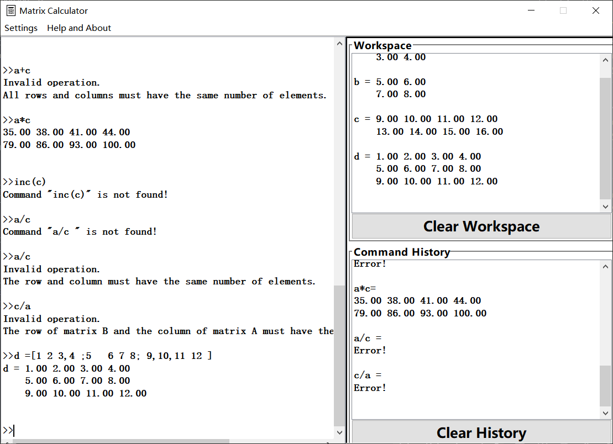
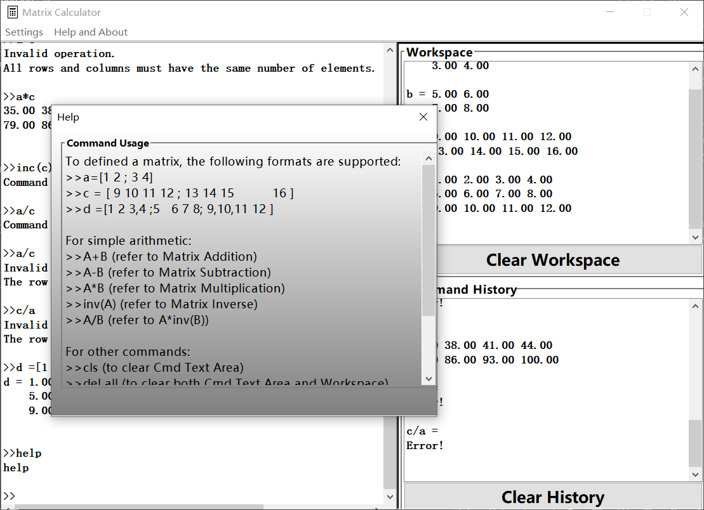
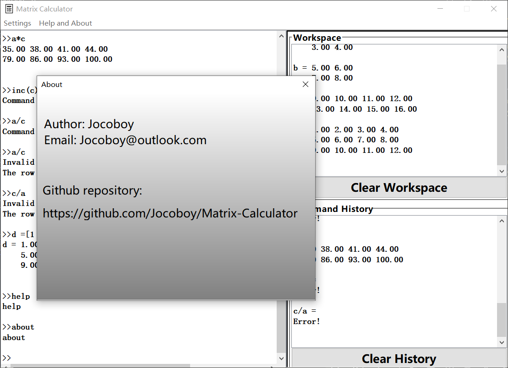

# Matrix Calculator

## :mag:Preview

### Main Window



### Help Window



### About Window




## :pencil:Usage

- To defined a matrix, the following formats are supported:
    ```
    >>a=[1 2 ; 3 4]
    >>c = [ 9 10 11 12 ; 13 14 15          16 ]
    >>d =[1 2 3,4 ;5   6 7 8; 9,10,11 12 ]
    ```

- For simple arithmetic:
    ```
    >>A+B (refer to Matrix Addition)
    >>A-B (refer to Matrix Subtraction)
    >>A*B (refer to Matrix Multiplication)
    >>inv(A) (refer to Matrix Inverse)
    >>A/B (refer to A*inv(B))
    ```

- For other commands
    ```
    >>cls (to clear Cmd Text Area)
    >>del all (to clear Workspace)
    >>help (to see Help Window)
    >>about (to see About Window)
    >>exit (to close Application)
    ```
- Equal command list
    ```
    [
        [cls, CLS, clear, CLEAR],
        [del all, DEL ALL, delete all, DELETE ALL],
        [inv(), INV(), inverse(), INVERSE()],
        [help, HELP],
        [about, ABOUT],
        [exit, EXIT]
    ]
    ```

## :heart:Friendly Link

[Click here](https://github.com/JiaxinTse/MatrixCalculator)

